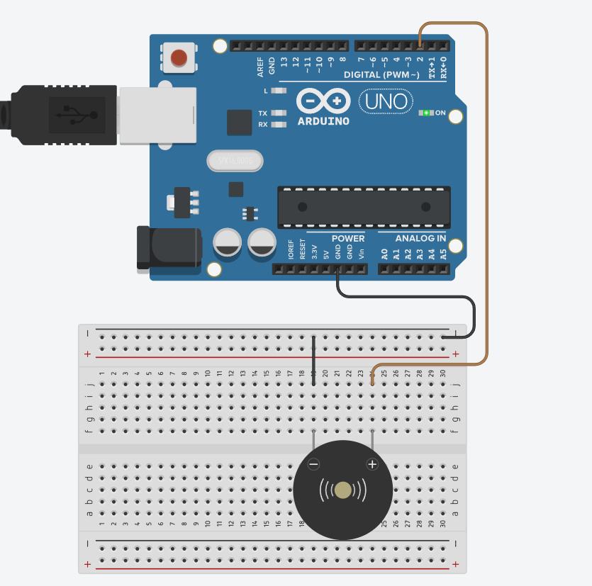

# :musical_note: Arduino Songs

## :warning: Importante

| Componente | Pin       |
|:--------:  |:---------:|
|   BuzerP   |    2      |
| BuzzerPbajo|    4      |

## :part_alternation_mark: Conexión
Nota: Se debe usar un Buzzer pasivo, ya que con este podemos controlar la frecuencia del mismo.

