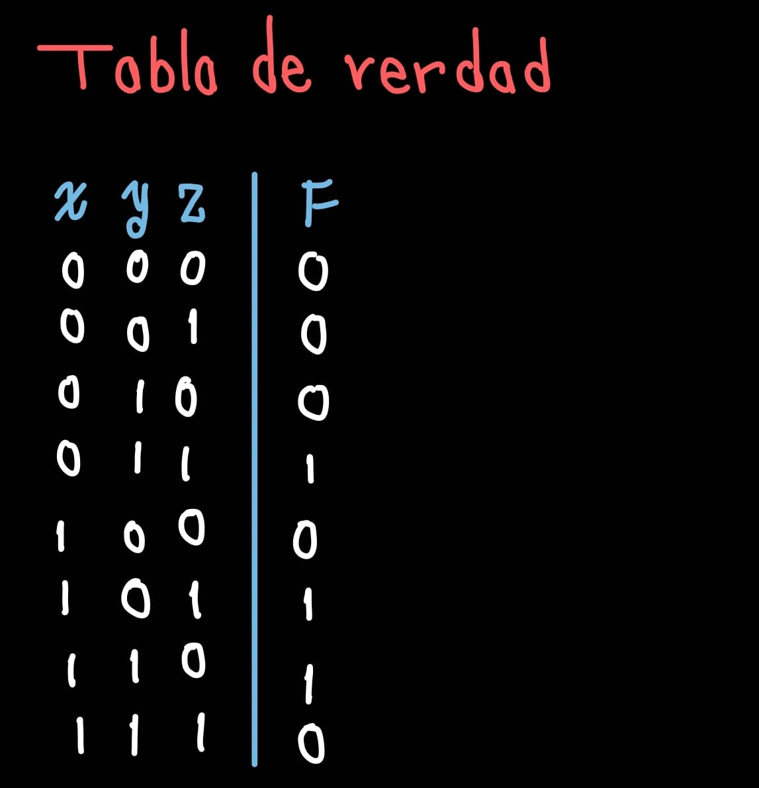
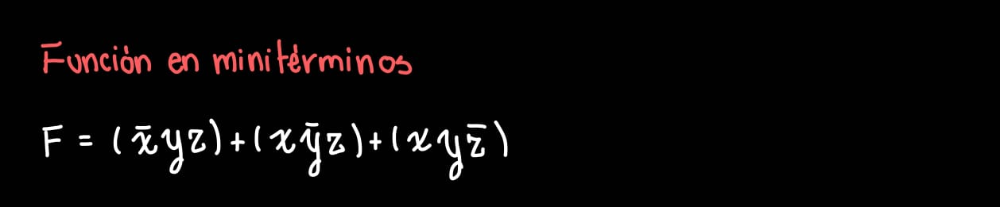
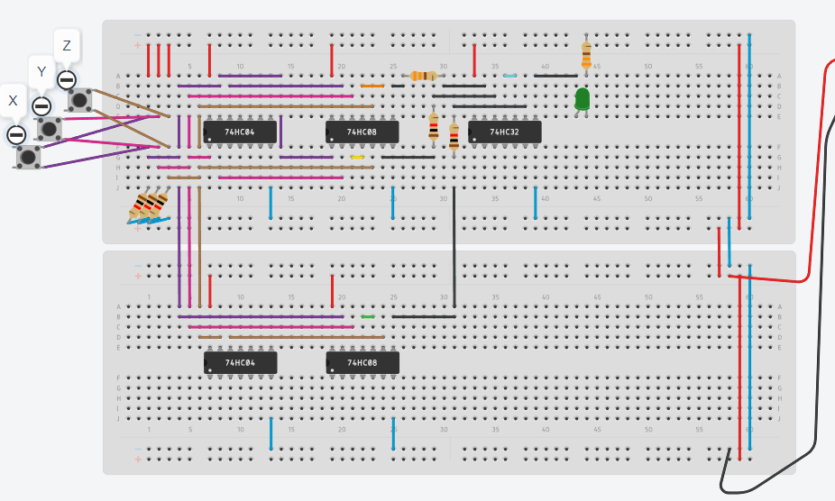

# Proyecto ED (Sistema de impresoras)

## Objetivo
Apreciar el funcionamiento de las compuertas 7404 (NOT), 7408 (AND) y 7432 (OR).
Así mismo a partir de uan función boolena crear el circuito físico y alambrarlo.

## Enunciado
En café internet se tienen tres impresoras...

## Tabla de verdad
 

## Función Boolena

La siguiente función está dada en minitérminos ya que es la manera más sencilla se alambrar para este caso.

 

## Alambrado

 