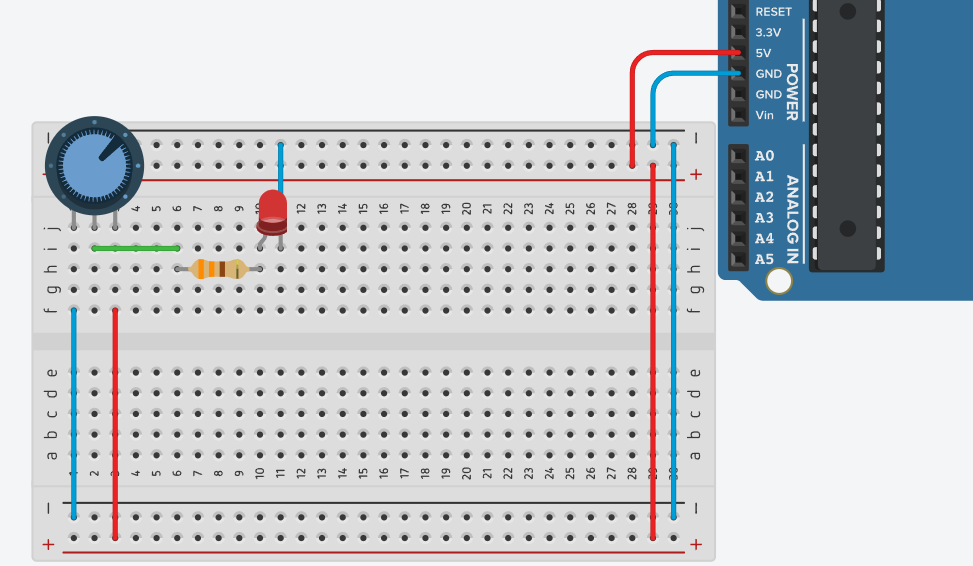
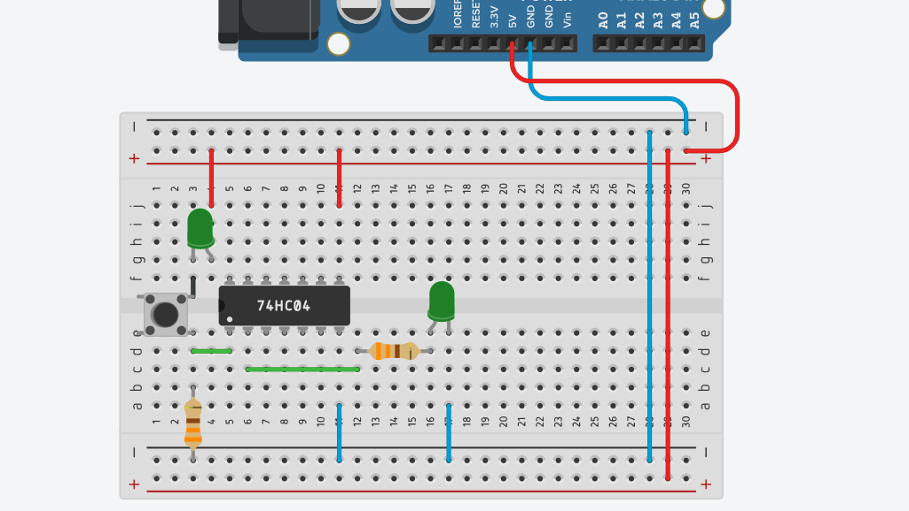
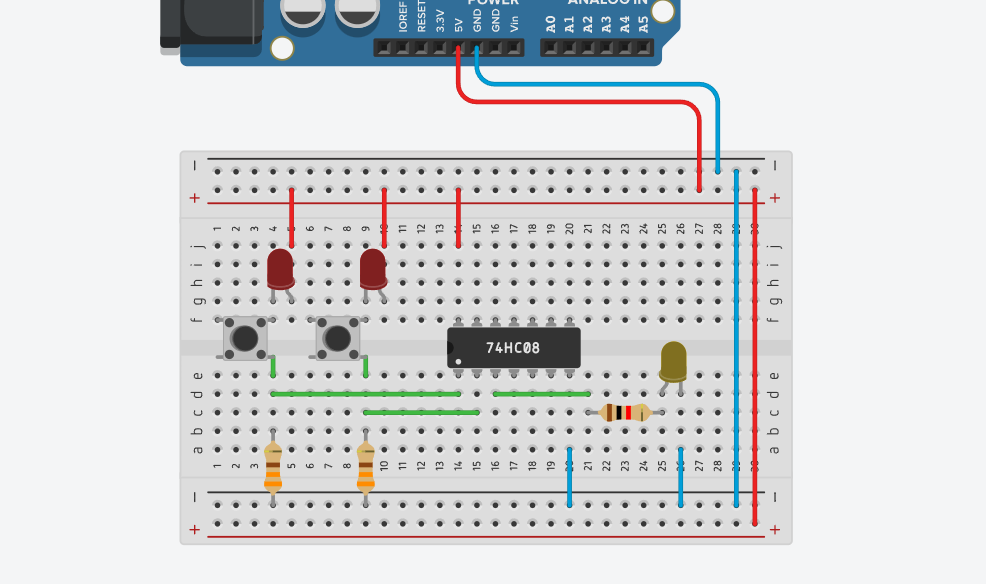

# Arduino y circuitos
El siguiente documento es para tener una guía de cómo conectar ciertos componentes.

 <!-- Para conexiones básicas-->
  
<h2>Conexiones básicas</h2>

<h3> LED</h3>

<h3>Potenciometro</h3>
 

 <!-- Para los circuitos lógicos-->
  
<h2>Circuitos lógicos</h2>

<h3> 74ls04 (NOT)</h3>

Nota: En la imagen se muestra un botón de doble puente, pero se conectó de tal manera para simular un botón de un solo puente.

 

<h3> 74ls08 (AND)</h3>

Nota: Se pondrá el botón como la conexión anterior par simular un botón con dos terminales.

  
