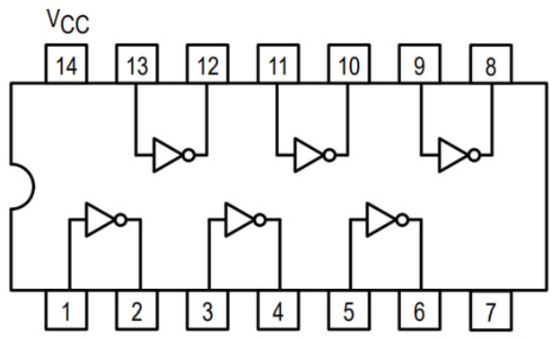
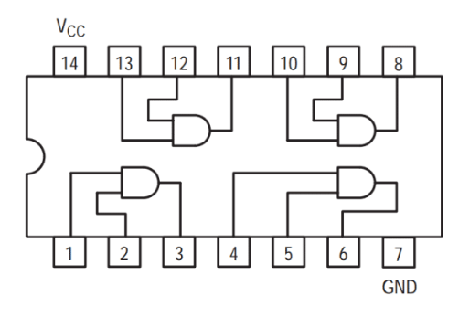
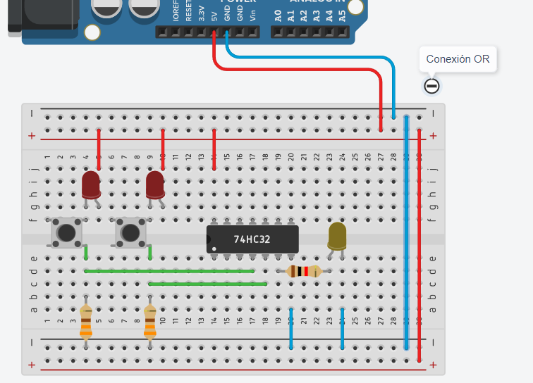
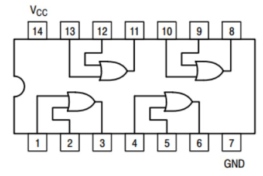
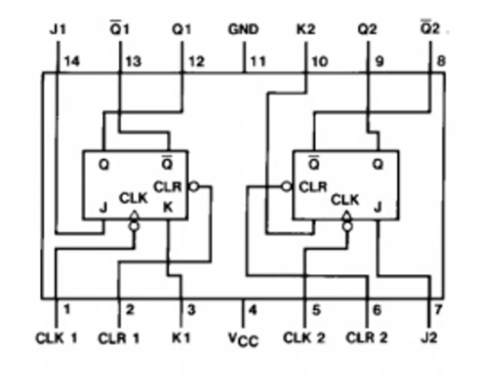

<h1 align="center">:star: Arduino y circuitos :star:</h1>

El siguiente documento es para tener una guía de cómo conectar ciertos componentes.

 <!-- Para conexiones básicas-->
  
<h2> :arrow_down_small: Conexiones básicas</h2>

<h3> LED</h3>

<h3>Potenciometro</h3>
 

 <!-- Para los circuitos lógicos-->
  
<h2> :arrow_down_small: Circuitos lógicos</h2>

<h3> 74ls04 (NOT)</h3>

Nota: En la imagen se muestra un botón de doble puente, pero se conectó de tal manera para simular un botón de un solo puente.

<!-- Para los circuitos lógicos
 

-->
<table> <tbody> <tr> <td> 
</td> <td> 
</a> </td> </tr> </tbody> </table>

 

<h3> 74ls08 (AND)</h3>

Nota: Se pondrá el botón como la conexión anterior par simular un botón con dos terminales.

<table> <tbody> <tr> <td> 
</td> <td> 
</a> </td> </tr> </tbody> </table>

<h3> 74ls32 (OR)</h3>

Nota: Todos los botones pueden ser sustituidos por un Switch.

<table> <tbody> <tr> <td> 
</td> <td> 
</a> </td> </tr> </tbody> </table>

 <!-- Para Diseño Digital-->
  
<h2> :arrow_down_small: Diseño Digital</h2>

<h3> 74ls73 (FLIP-FLOP JK)</h3>
<table> <tbody> <tr> <td> 
</td> <td> 
</a> </td> </tr> </tbody> </table>

  
